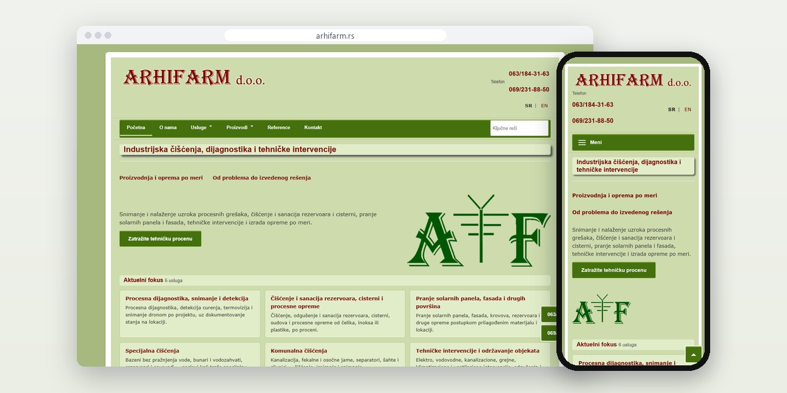
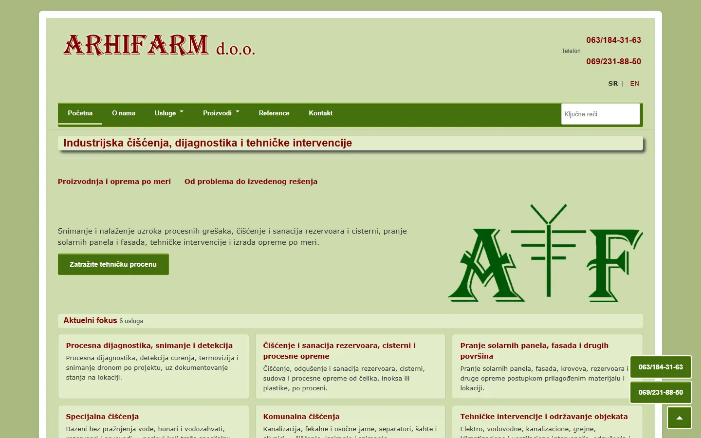
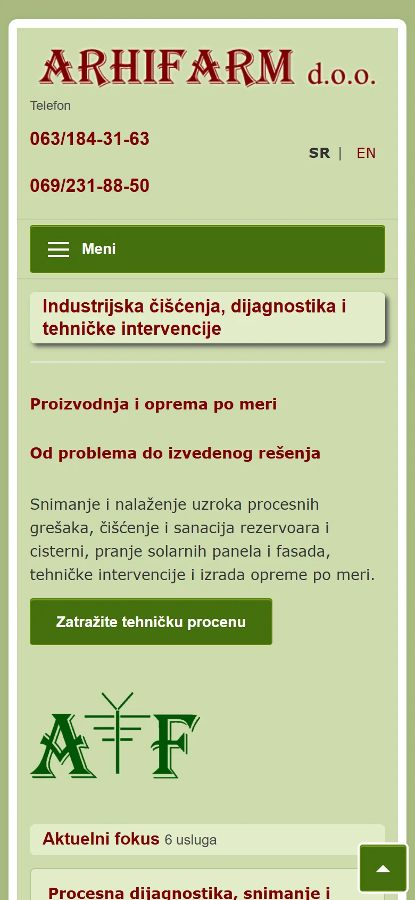
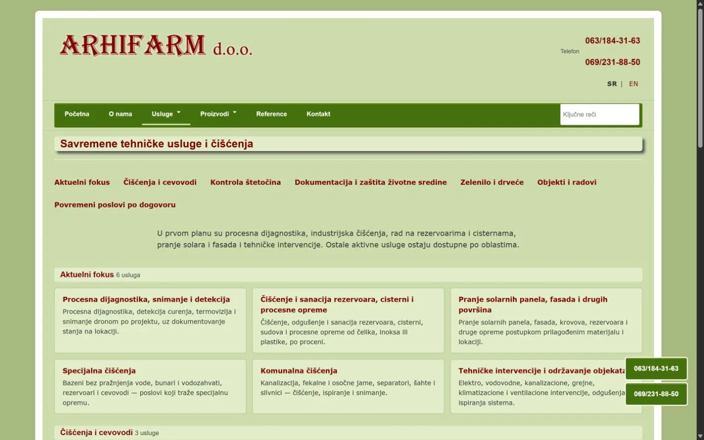
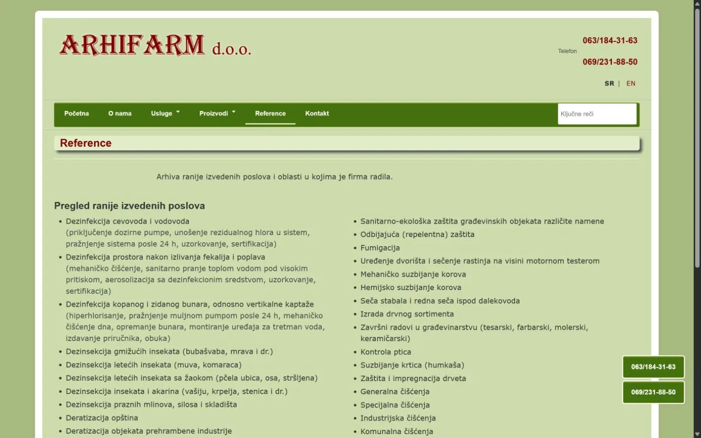

# ARHIFARM

Website and content management system for an industrial cleaning and diagnostics company.

**[arhifarm.rs](https://arhifarm.rs/)** · [Case study (in Serbian)](https://svilenkovic.com/radovi/arhifarm) · [Srpski](README.sr.md)

> [!NOTE]
> Client project. The source code belongs to the client and stays in a private repository. This page describes what I built and how.

<table>
  <tr><td><b>Client</b></td><td>ARHIFARM</td></tr>
  <tr><td><b>Industry</b></td><td>Industrial cleaning, process diagnostics and custom equipment</td></tr>
  <tr><td><b>Location</b></td><td>Serbia</td></tr>
  <tr><td><b>Type</b></td><td>Business website with its own CMS</td></tr>
  <tr><td><b>My role</b></td><td>Design, development, CMS, SEO, hosting and maintenance</td></tr>
  <tr><td><b>Stack</b></td><td>PHP 8.3, MariaDB, custom CMS, block editor</td></tr>
</table>

## About the project

ARHIFARM cleans tanks, tankers, solar panels and facades, runs process diagnostics and builds equipment to order. None of that fits into one photo and a slogan, so every service area got its own section with the work process, photos, documents and references.

The client edits the site from a panel I built for them. A page is put together from blocks: hero, text, gallery, steps, tables, documents, products, references and FAQ. Block order and visibility change from the panel, without touching the public templates.

## What I built

- A custom CMS in PHP 8.3 and MariaDB with a block editor, revisions, menus, a media library, documents and redirects
- An inbox in the admin panel for inquiries sent from the site
- One PHP entry point for public requests, with the application, config and database kept outside the web root
- URLs, menus and redirects stored apart from content, so a Serbian and an English version can grow without rebuilding the system
- Structured data for the business and the site, security headers and valid HTML

## Results

| | Performance | Accessibility | Best practices | SEO |
| :-- | :-: | :-: | :-: | :-: |
| Mobile | 100 | 100 | 100 | 100 |
| Desktop | 100 | 100 | 100 | 100 |

PageSpeed Insights, lab test of the live site, September 2026. Security headers: 6 of 6. HTML validator: no errors. axe accessibility check: no violations. Structured data: `LocalBusiness`.

## Screenshots

<table>
  <tr>
    <td width="68%" valign="top"></td>
    <td width="32%" valign="top"></td>
  </tr>
</table>

Services split into the current focus, cleaning jobs and pipeline work

References and an overview of completed projects

---

Built by [D. Svilenković](https://svilenkovic.com).
